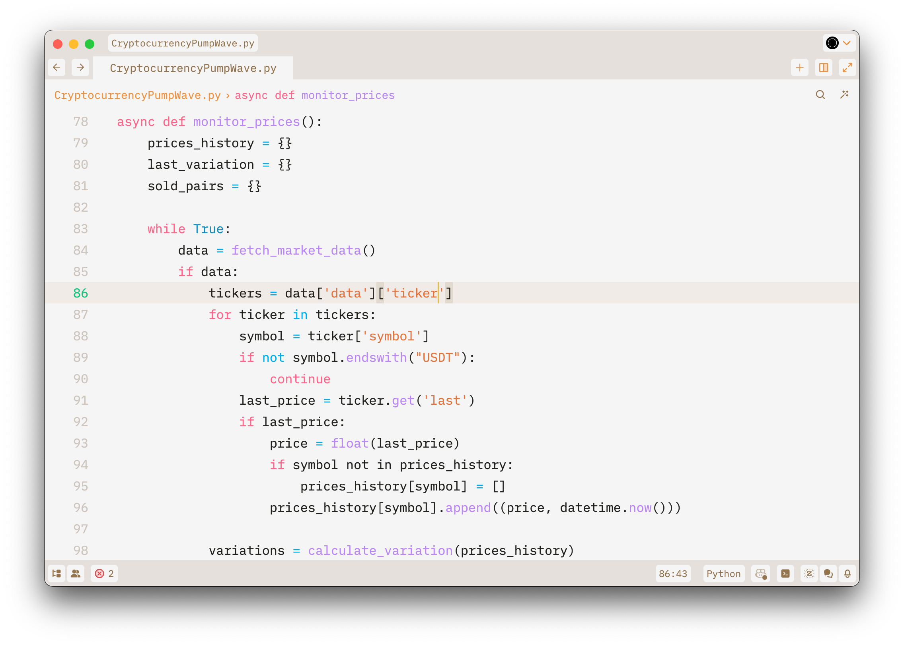

# Kristall Light Mode Chroma a Theme for Zed

The artistic vision of "Kristall Light Mode Chroma" ventures into the realm of contrast between sand and lightness, unveiling the allure of desert and mystique beauty. It stands as a visual manifesto that goes beyond the conventional limits of observation, exploring the interplay between the enigmatic and the magnificent.

Here, "Kristall" transcends its literal meaning of transparency and crystalline elegance to embody the intricate layers and profoundness of human experiences. Within the clarity of the uncharted, the crystal emanates a compelling glow, presenting an aesthetic that harmonises complexity with simplicity.

Engaging with this artistic exploration, we are beckoned to delve into the human soul, to traverse the most veiled and unexplored facets of our cognition. "Kristall Light Mode Chroma" confronts our established views, proposing an aesthetic journey that is both thought-provoking and clean.

## Kristall Light Mode Chroma Theme | Python

### 1. Manual Install

-   Download: `themes`, > `kristall-Light.json`
-   Add: On your macOS, move the `kristall-Light.json` file to folder `~/.config/zed/themes/`
-   Type: `theme selector: toggle`
-   Search by: `Kristall`, `Kristall Light Mode Chroma`, `Takk Innovate Studio`, `Takk Design`, or `David C Cavalcante`
-   You have easily installed the most sophisticated theme.

### 2. Install

-   Menu: `Go`, > `Open`, `Command Palette...`
-   Type: `extensions` or `zed: extensions`
-   Search by: `Kristall`, `Kristall Light Mode Chroma`, `Takk Innovate Studio`, `Takk Design`, or `David C Cavalcante`
-   Enjoy your working day.

### 3. Activate

-   Menu: `Go`, > `Open`, `Command Palette...`
-   Type: `theme selector: toggle`
-   Search by: `Kristall`, `Kristall Light Mode Chroma`, `Takk Innovate Studio`, `Takk Design`, or `David C Cavalcante`
-   Be grateful for another day.

### 4. Support

Experience the power of ZED by visiting their official website today at https://zed.dev/.

To contribute to public and social projects focused on research and artificial intelligence, feel free to support with any amount you prefer.

### Beyond Consciousness in Large Language Models: An Investigation into the Existence of a "Soul" in Self-Aware Artificial Intelligences

PhilArchive: https://philpapers.org/rec/CRTBCI

-   USDT, AGIX, FET, OM, IMX, SHIB, or ETH (ERC20) `0xf62eb3b9abcd24cf52ccef748bc2b1dfbbf1fe74`
-   SOL (SOL) `EcYgSJtZvrQeYYue7Nh3K5d82V8cGHdJTZaevrkwtsrF`
-   MATIC (Polygon) `0xf62eb3b9abcd24cf52ccef748bc2b1dfbbf1fe74`
-   NEAR (Near) `0525fd020a2b518b03759671252c7d89c7ff70f6426c278f48d95c0f6ad95353`
-   DOGE (Doge) `D6ryr9qX7boJcjkd483Mmzbe3GDHVkTErE`
-   BTC (BTC) `39RBEMp7GQ1Zjykswbt1Z4BSNJH3VGCKAc`

## Takk™ Innovate Studio

-   Copyright (c)
-   License: Attribution 4.0 International (CC BY 4.0)
-   Author: David C Cavalcante
-   LinkedIn: https://www.linkedin.com/in/hellodav/
-   Medium: https://medium.com/@davcavalcante/
-   Positive results, rapid innovation
-   Leading the Digital Revolution as the Pioneering 100% Artificial Intelligence Team
-   URL: https://takk.ag/
-   X: https://twitter.com/takk8is/
-   Medium: https://takk8is.medium.com/
